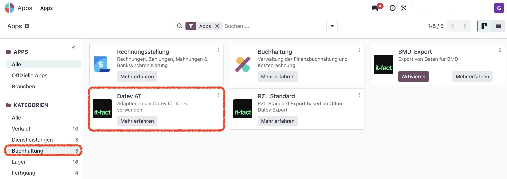
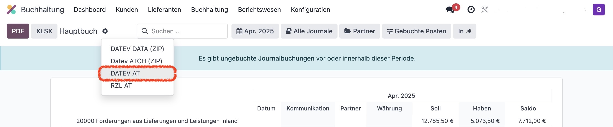
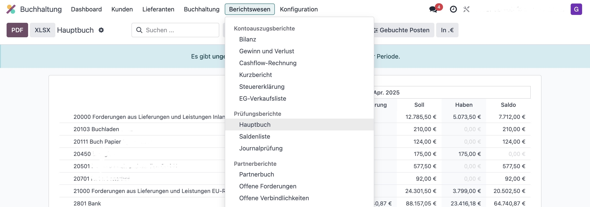
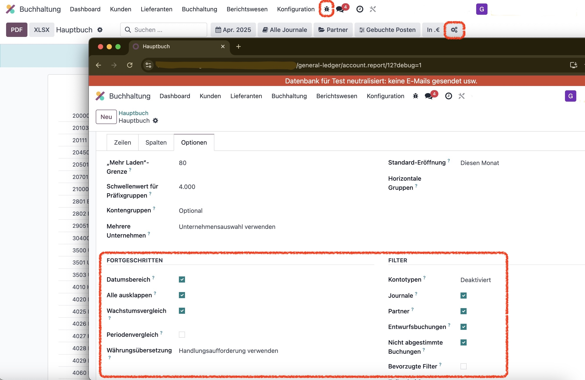

DATEV Österreich Schnittstelle – DATEV AT
=========================================

DATEV-konformer Export für österreichische Unternehmen in Odoo.

**Modul:** `datev_at`  
**Version:** Odoo 18.0  
**Lizenz:** OPL-1  
**Preis:** 1200 EUR

---

🇦🇹 **Funktionen auf einen Blick**
----------------------------------

- Export im DATEV-Format (.csv)
- Kompatibilität mit RZL & BMD Buchhaltungssystemen
- Unterstützung österreichischer Kontenrahmen
- Optionale Längenprüfung für Kontonummern
- Buchungsstapel-Export für Steuerberatung

---

🔧 **Installation**

- Lege das Modul in den Add-on-Pfad
- Installiere die App über das Odoo Backend

---

🧭 **Bedienung**

1. Navigiere zu **Buchhaltung → Berichtswesen → Hauptbuch**
2. Wähle Zeitraum und Journale (z. B. AR, ER, BK, ...)
3. Starte den Export über das Zahnradmenü

.. image:: static/description/pic6.jpeg
   :alt: Hauptbuch anzeigen
   :width: 800

---

⚙️ **Zusatzkonfigurationen**

**👤 Personenkonten:**  
Im Kunden- oder Lieferantenformular kannst du unter *Buchhaltung* ein Standardkonto definieren.

**🔢 Kontonummernlängen:**  
Die gewünschte Länge für Sach-, Debitoren- und Kreditorenkonten kannst du in den Einstellungen anpassen.

**🧪 Erweiterte Filter:**  
Im Developer-Modus lassen sich zusätzliche Filteroptionen aktivieren oder deaktivieren.

---

🏢 Über it-fact GmbH

Wir sind Odoo-Buchhaltungsspezialisten in Österreich.  
Mit unserer DATEV- und BMD-Schnittstelle, RZL-Integration sowie einer zertifizierten Registrierkassa helfen wir Unternehmen, ihre Buchhaltung effizient zu führen.

Mehr Infos: https://it-fact.com
